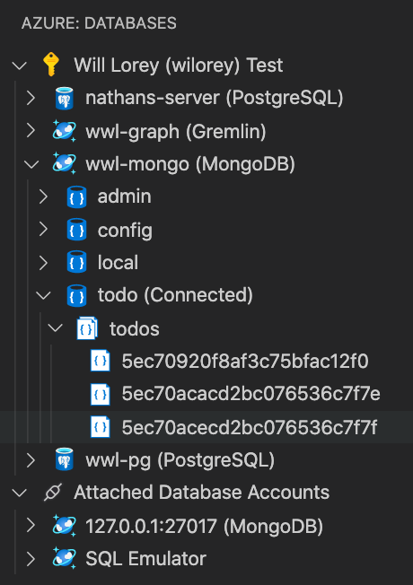
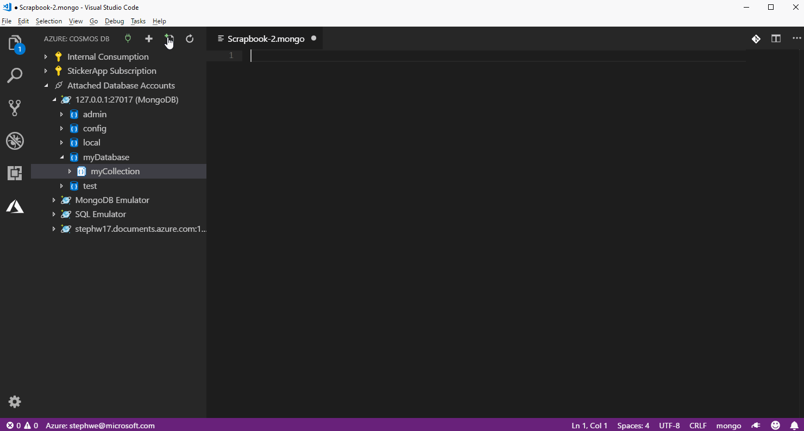
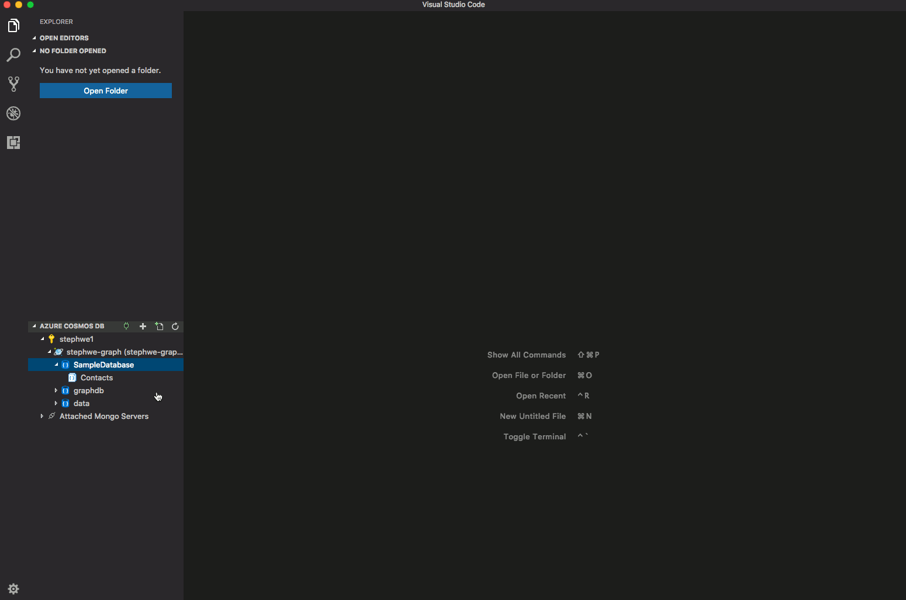
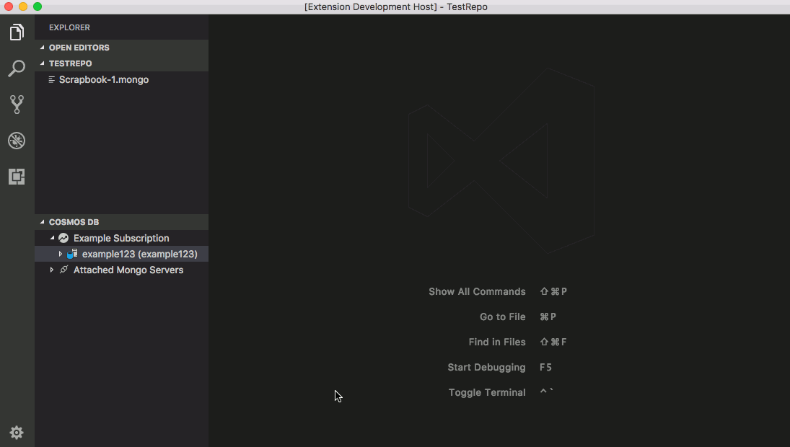
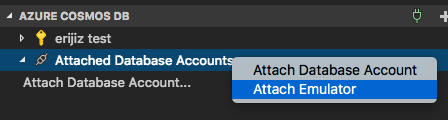
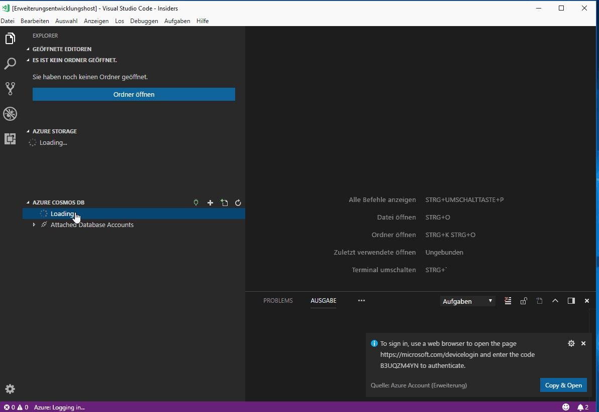
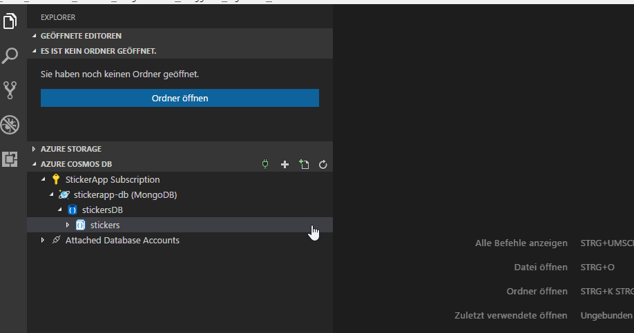

# Cosmos DB Support for VS Code (Preview)

[](https://marketplace.visualstudio.com/items?itemName=ms-azuretools.vscode-cosmosdb) [](https://marketplace.visualstudio.com/items?itemName=ms-azuretools.vscode-cosmosdb) [](https://travis-ci.org/Microsoft/vscode-cosmosdb)

Browse and query your MongoDB databases both locally and in the cloud using [_scrapbooks_](#mongo-scrapbooks) with rich Intellisense then connect to Azure to manage your Cosmos DB databases with support for MongoDB, Graph (Gremlin), and SQL (previously known as DocumentDB).


# We've Moved!

You will now find us by clicking in the new Azure view container instead of the file explorer.

# Prerequisites

- Some less-common commands in the Mongo [scrapbook](#mongo-scrapbooks) and use of the Mongo shell require installing [Mongo DB and Mongo shell](https://docs.mongodb.com/manual/installation/).

# Features

## Cosmos DB Explorer

- Create a Cosmos DB account by clicking the `+` button in the title
- View Azure Cosmos DB accounts and open directly in the portal
- View/Create/Delete databases, collections, graphs, stored procedures, and documents
- Click on a document or stored procedure to open in the editor
- Click on a graph to visualize data
- Query graph using [Gremlin](https://docs.microsoft.com/azure/cosmos-db/gremlin-support)
- Edit a document and persist changes to the cloud
- Attach a Mongo server by clicking the plug icon in the title



## Mongo Scrapbooks
### Run Mongo Commands with Rich Intellisense

- View your MongoDB database account by [signing in to Azure](#managing-azure-subscriptions) or using "Attach Database Account" to connect via a connection string
- Optionally configure the setting `mongo.shell.path` if your mongo executable is not already on your system's PATH (many of the common commands have built-in support and do not require the Mongo shell to be installed - see [Prerequisites](#prerequisites))
- Click on "New Mongo Scrapbook" in the tree title bar
- Click on "Connect to a database" to indicate which database to run the commands against
- Enter your commands and/or comments, eg: `db.<collectionName>.find()`
- IntelliSense (auto-completions) will be provided
- Click on "Execute" above a command to execute it, or press `CMD+"` (Mac) or `CTRL+"` (Windows and Linux) to execute the line with the cursor.
- To run all commands, click on "Execute All", or press `CMD+:` or `Ctrl+:`
- Save and re-use later


## Use [Gremlin](https://docs.microsoft.com/azure/cosmos-db/gremlin-support) to query graphs



- <a name="graphSettings"></a>Configure the user setting `cosmosDB.graph.viewSettings` to customize which properties to display and which colors to use based on vertex label.
```javascript
    "cosmosDB.graph.viewSettings": [
        {
            "vertexSettings": [
                {
                    // Default settings for all vertices
                    "displayProperty": [
                        // Display name property if exists, otherwise firstName if it exists, otherwise ID
                        "name",
                        "firstName"
                    ],
                    // Auto-choose color by label
                    "color": "auto",
                    // Show label after display property
                    "showLabel": true
                },
                {
                    // These setting apply to vertices with the label 'person'
                    "appliesToLabel": "person",
                    "color": "blue"
                }
            ]
        }
    ]
```

## Create a Cosmos DB Account



## Attach to the Cosmos DB Emulator

* Install and run the [Cosmos DB Emulator](https://docs.microsoft.com/azure/cosmos-db/local-emulator) on your local machine
* Right click 'Attached Database Accounts' and select 'Attach Emulator'



## Managing Azure Subscriptions

If you are not signed in to Azure, you will see a "Sign in to Azure..." link. Alternatively, you can select "View->Command Palette" in the VS Code menu, and search for "Azure: Sign In".



If you don't have an Azure Account, you can sign up for one today for free and receive $200 in credits by selecting "Create a Free Azure Account..." or selecting "View->Command Palette" and searching for "Azure: Create an Account".

You may sign out of Azure by selecting "View->Command Palette" and searching for "Azure: Sign Out".

To select which subscriptions show up in the extension's explorer, click on the "Select Subscriptions..." button on any subscription node (indicated by a "filter" icon when you hover over it), or select "View->Command Palette" and search for "Azure: Select Subscriptions". Note that this selection affects all VS Code extensions that support the [Azure Account and Sign-In](https://github.com/Microsoft/vscode-azure-account) extension.



## Known Issues

- Azure no longer supports gremlin queries on pre-GA graph accounts. If you see the error "Could not find a valid gremlin endpoint for *graph*", then choose "Open Portal" on the graph node and check the "Gremlin Endpoint" in the Overview tab. If it does not take the form of '...[graph-name].***gremlin***.cosmosdb.azure.com...', then you will need to create a new graph account using the Azure portal or the current version of the extension.
- Graphs are not currently supported with the emulator
- Viewing/editing tables is not currently supported

# Contributing
There are several ways you can contribute to our [repo](https://github.com/Microsoft/vscode-cosmosdb):

- **Ideas, feature requests and bugs**: We are open to all ideas and we want to get rid of bugs! Use the [Issues](https://github.com/Microsoft/vscode-cosmosdb/issues) section to report a new issue, provide your ideas or contribute to existing threads.

- **Documentation**: Found a typo or strangely worded sentences? Submit a PR!
- **Code**: Contribute bug fixes, features or design changes:
  - Clone the repository locally and open in VS Code.
  - Open the terminal (press `CTRL+`\`) and run `npm install`.
  - To build, press `F1` and type in `Tasks: Run Build Task`.
  - Debug: press `F5` to start debugging the extension.

## Legal
Before we can accept your pull request you will need to sign a **Contribution License Agreement**. All you need to do is to submit a pull request, then the PR will get appropriately labelled (e.g. `cla-required`, `cla-norequired`, `cla-signed`, `cla-already-signed`). If you already signed the agreement we will continue with reviewing the PR, otherwise system will tell you how you can sign the CLA. Once you sign the CLA all future PR's will be labeled as `cla-signed`.

## Code of Conduct
This project has adopted the [Microsoft Open Source Code of Conduct](https://opensource.microsoft.com/codeofconduct/). For more information see the [Code of Conduct FAQ](https://opensource.microsoft.com/codeofconduct/faq/) or contact [opencode@microsoft.com](mailto:opencode@microsoft.com) with any additional questions or comments.

# Telemetry
VS Code collects usage data and sends it to Microsoft to help improve our products and services. Read our [privacy statement](https://go.microsoft.com/fwlink/?LinkID=528096&clcid=0x409) to learn more. If you don’t wish to send usage data to Microsoft, you can set the `telemetry.enableTelemetry` setting to `false`. Learn more in our [FAQ](https://code.visualstudio.com/docs/supporting/faq#_how-to-disable-telemetry-reporting).

# License
[MIT](LICENSE.md)
