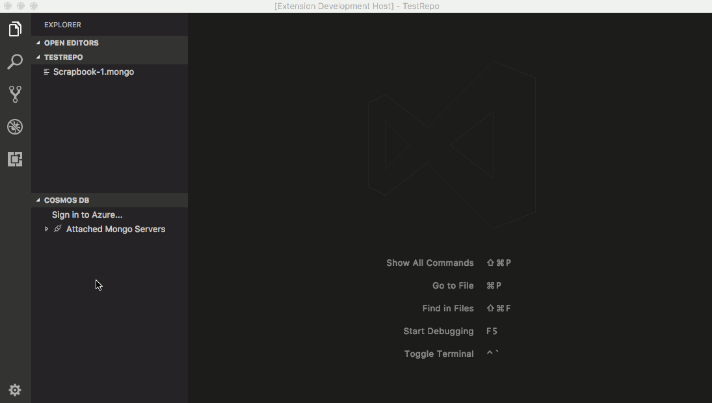
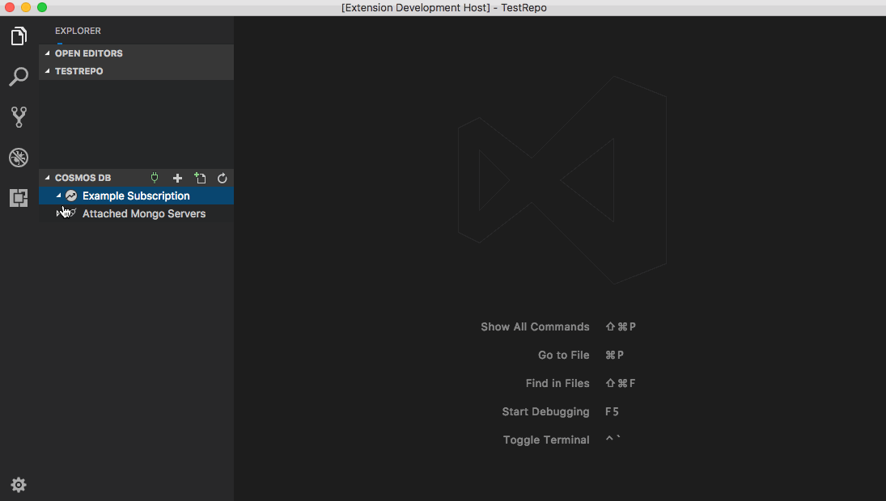

# Cosmos DB Support for VS Code (Preview)

# Prerequisites

- For Mongo DB support, install [Mongo DB and Mongo shell](https://docs.mongodb.com/manual/installation/).

# Features

## Cosmos DB Explorer

- Create a Cosmos DB account by clicking the `+` button in the title
- View Azure Cosmos DB accounts and open directly in the portal
- Attach a Mongo server by clicking the plug icon in the title
  - Typical connection string for a local MongoDB instance: `mongodb://localhost:27017`

MongoDB and DocumentDB accounts* support the following:
- View/Create/Delete databses, collections, and documents
- Click on a document to open in the editor
- Edit a document and persist changes to the cloud
- 'Load more' documents in the explorer

*Support for other CosmosDB apis (i.e. Graph and Table) is coming soon!

## Mongo "Scrapbooks"

- Configure the user setting `mongo.shell.path` to your mongo shell executable path
- Click on any DB to open the Mongo shell playground editor
- Enter your scripts, eg: `db.<collectionName>.find()`
- IntelliSense (completions) will be provided as you write your scripts
- Select the script and press `CMD+"` (`CTRL+"` on Windows and Linux) to see the results

## Sign in to Azure to view your Cosmos DB Accounts

## Create a Cosmos DB Account

## Create and Run Mongo Commands in a Scrapbook with Rich Intellisense

# Contributing
There are a couple of ways you can contribute to this repo:

- **Ideas, feature requests and bugs**: We are open to all ideas and we want to get rid of bugs! Use the Issues section to either report a new issue, provide your ideas or contribute to existing threads.
- **Documentation**: Found a typo or strangely worded sentences? Submit a PR!
- **Code**: Contribute bug fixes, features or design changes:
  - Clone the repository locally and open in VS Code.
  - Open the terminal (press `CTRL+`\`) and run `npm install`.
  - To build, press `F1` and type in `Tasks: Run Build Task`.
  - Debug: press `F5` to start debugging the extension.

## Legal
Before we can accept your pull request you will need to sign a **Contribution License Agreement**. All you need to do is to submit a pull request, then the PR will get appropriately labelled (e.g. `cla-required`, `cla-norequired`, `cla-signed`, `cla-already-signed`). If you already signed the agreement we will continue with reviewing the PR, otherwise system will tell you how you can sign the CLA. Once you sign the CLA all future PR's will be labeled as `cla-signed`.

## Code of Conduct
This project has adopted the [Microsoft Open Source Code of Conduct](https://opensource.microsoft.com/codeofconduct/). For more information see the [Code of Conduct FAQ](https://opensource.microsoft.com/codeofconduct/faq/) or contact [opencode@microsoft.com](mailto:opencode@microsoft.com) with any additional questions or comments.

# Telemetry
This extension collects telemetry data to help us build a better experience with Cosmos DB and VS Code. The extension respects the `telemetry.enableTelemetry` setting which you can learn more about in our [FAQ](https://code.visualstudio.com/docs/supporting/faq#_how-to-disable-telemetry-reporting).

# License
[MIT](LICENSE.md)
