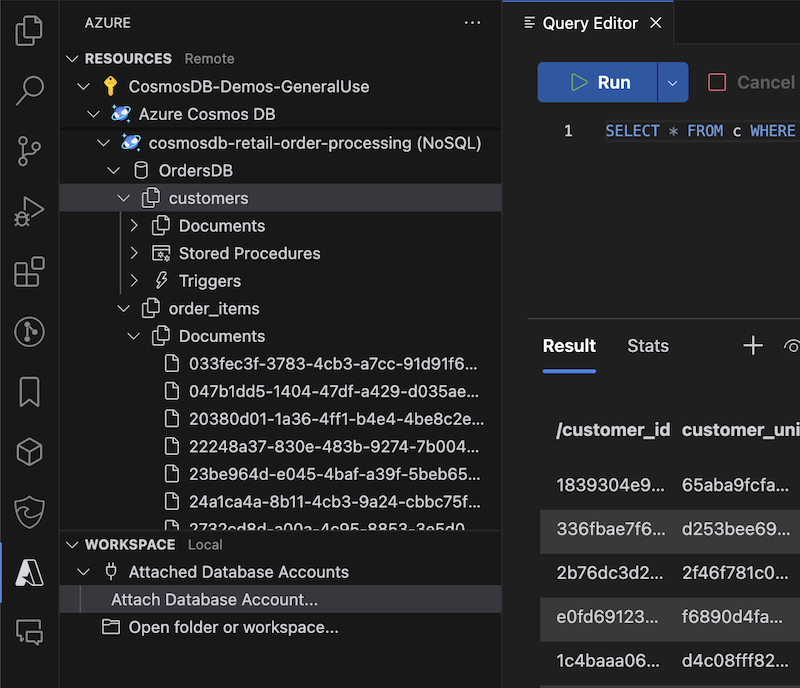
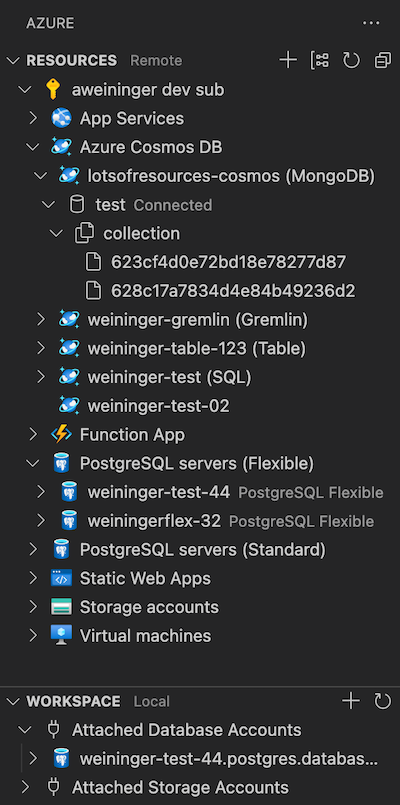
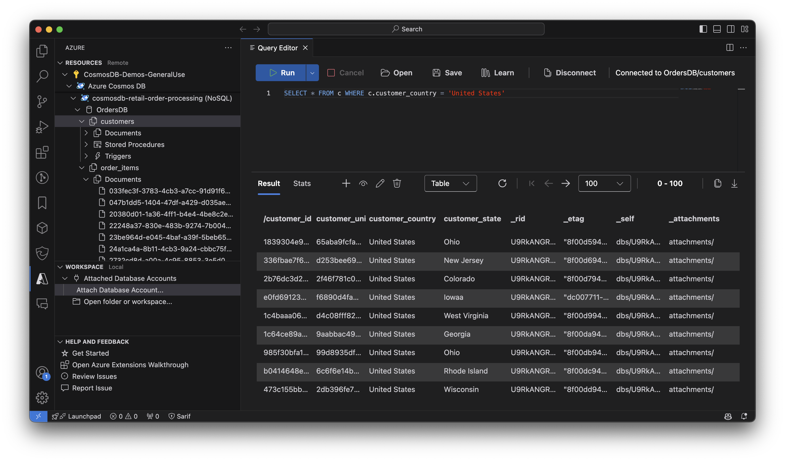
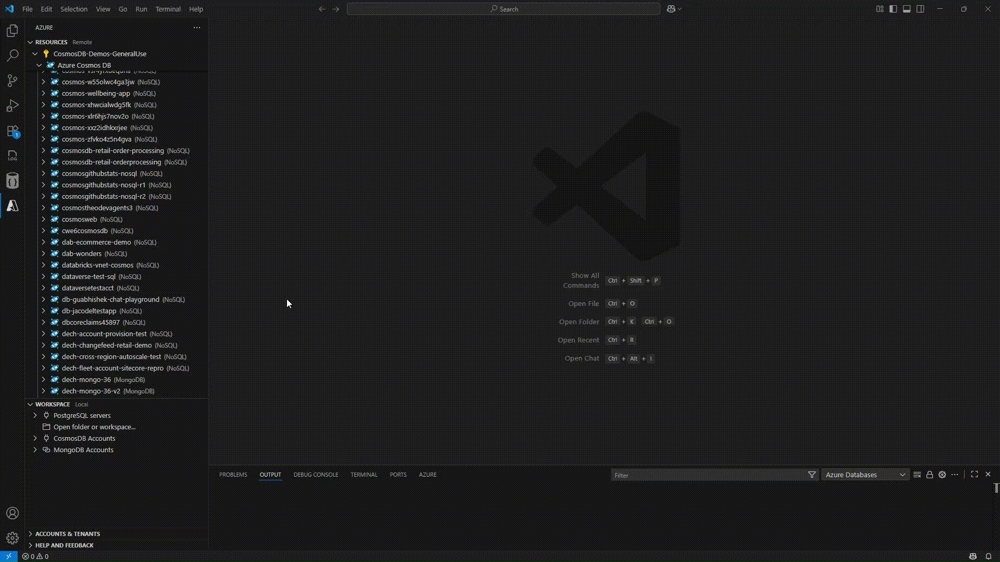
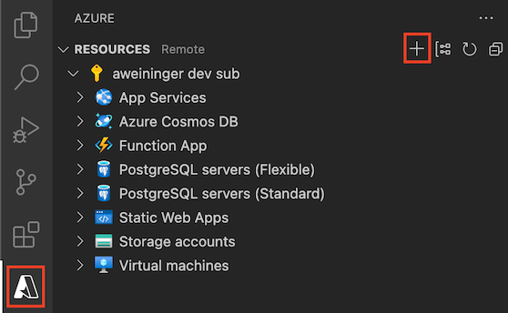
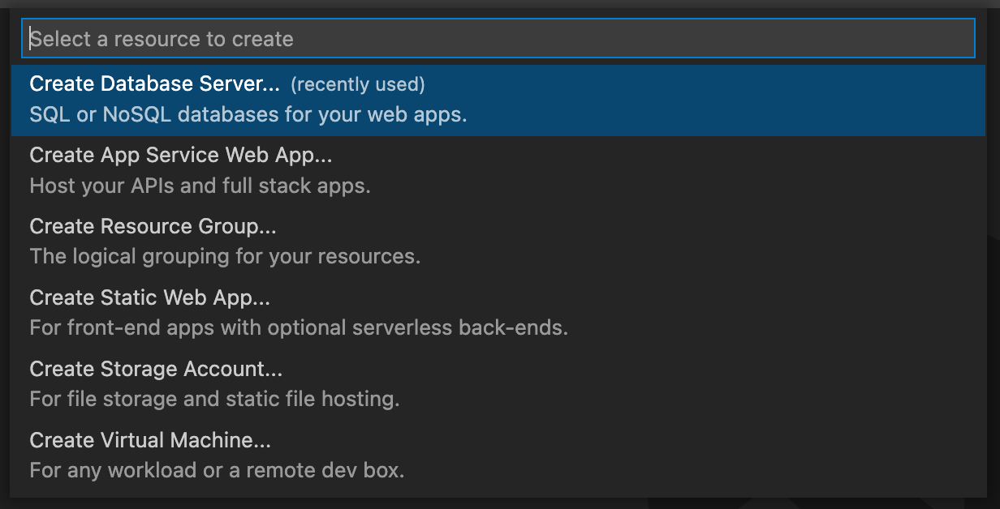
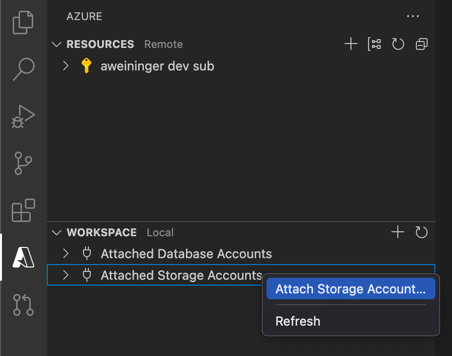

# Azure Databases for VS Code (Preview)

<!-- region exclude-from-marketplace -->

  

<!-- endregion exclude-from-marketplace -->

Browse, manage and query your Azure databases both locally and in the cloud with support for MongoDB, Graph (Gremlin), and NoSQL (previously known as DocumentDB).

> Sign up today for your free Azure account and receive 12 months of free popular services, $200 free credit and 25+ always free services 👉 [Start Free](https://azure.microsoft.com/free/open-source).

# Prerequisites

- Some less-common commands in the Mongo [scrapbook](#mongo-scrapbooks) and use of the Mongo shell require installing [Mongo DB and Mongo shell](https://docs.mongodb.com/manual/installation/).

# Features

## Azure Databases Explorer

- Find database servers in your Azure subscription
- Create a database server using the `+` button
- Open database servers in the Azure portal
- View/Create/Delete databases, collections, graphs, stored procedures, documents, and queries
- Open documents, stored procedures, or queries in the editor
- Edit documents and persist changes to the cloud
- Attach database servers to your Workspace using connection strings

## Query Editor

- Write Queries with Syntax Highlighting
- Show Query history and save/open queries on disk
- Execute Queries and see the results (currently NoSQL only)
- Show results in a table, as JSON or in a hierarchical tree view
- Copy results as JSON or CSV to the clipboard or store them in a file
- Choose how many results to show at once with paging support
- Show Query Statistics (consumed RUs, time, size and other metrics)
- View, Edit and Update single documents from the result view
- Create new documents with syntax highlighting and partition key validation

## Improved MongoDB Cluster Support

The extension now offers enhanced support for MongoDB clusters, making it easier than ever to connect, view, and manage your MongoDB resources, whether on Azure or any external cluster.

- **Seamless Connectivity with Azure Cosmos DB for MongoDB vCore**: Effortlessly connect to Azure Cosmos DB for MongoDB vCore.
- **Universal MongoDB Connectivity**: Easily connect to any MongoDB cluster using a connection string, giving you flexibility in managing databases across multiple environments.
- **Comprehensive Collection Viewer**: Navigate collections with rich visualization options, including **Table**, **Tree**, and **JSON views**, to quickly understand and explore your data.
- **Enhanced Query Experience**: Execute find queries with **syntax highlighting** and **intelligent auto-completion**, including field name suggestions, to boost productivity and reduce errors.
- **Paging Support for Large Datasets**: Efficiently browse through large collections with built-in paging support, enabling you to handle data exploration without overwhelming the interface.
- **Document Management**: View, edit, and delete individual documents directly from the interface. Gain the flexibility to manage documents in-place, streamlining the database management process.
- **JSON Import and Export**: Import data from JSON files or export documents as needed. You can even export entire collections or the result of a query, making data sharing simpler and more efficient.

## Scrapbooks

### Run Mongo Commands with Rich Intellisense

- View your MongoDB database account by clicking "Sign in to Azure..." in the Azure Resources explorer or using "Attach Database Account" to connect via a connection string
- Optionally configure the settings `mongo.shell.path` and `mongo.shell.args` if your mongo executable is not already on your system's PATH (many of the common commands have built-in support and do not require the Mongo shell to be installed - see [Prerequisites](#prerequisites))
- Click on "New Mongo Scrapbook" in the tree title bar
- Click on "Connect to a database" to indicate which database to run the commands against
- Enter your commands and/or comments, eg: `db.<collectionName>.find()`
- IntelliSense (auto-completions) will be provided
- Click on "Execute" above a command to execute it, or press <kbd>CMD</kbd>+<kbd>"</kbd> (Mac) or <kbd>CTRL</kbd>+<kbd>"</kbd> (Windows and Linux) to execute the line with the cursor
- To run all commands, click on "Execute All", or press <kbd>CMD</kbd>+<kbd>:</kbd> or <kbd>Ctrl</kbd>+<kbd>:</kbd>
- Save and re-use later
  

## Import into Cosmos DB

- You can now import documents from your workspace into CosmosDB. Use the context menu of a collection or a document file (json) to get started!
  

## Create an Azure Databases Server

1. Sign in to your Azure Account by clicking "Sign in to Azure..." in the Azure Resources explorer
   > If you don't already have an Azure Account, select "Create a Free Azure Account"
2. Select the `+` button to open the "Create Resource" menu
   
3. Choose "Create Database Server..."
   

## Attach to the Cosmos DB Emulator

- Install and run the [Cosmos DB Emulator](https://docs.microsoft.com/azure/cosmos-db/local-emulator) on your local machine
- Right click 'Attached Database Accounts' and select 'Attach Emulator'

## Known Issues

- Azure no longer supports gremlin queries on pre-GA graph accounts. If you see the error "Could not find a valid gremlin endpoint for _graph_", then choose "Open Portal" on the graph node and check the "Gremlin Endpoint" in the Overview tab. If it does not take the form of '...[graph-name].**_gremlin_**.cosmosdb.azure.com...', then you will need to create a new graph account using the Azure portal or the current version of the extension.
- Graphs are not currently supported with the emulator
- Viewing/editing tables is not currently supported
- Support for escapes in the scrapbooks is preliminary. We currently do not support escaped characters as is inside a string - the characters need to be double escaped. For example, newlines in the string should be '\\\\n' instead of '\\n' to be recognized correctly. If you find any issues with how the scrapbook handles escapes, please add to issue [#937](https://github.com/Microsoft/vscode-cosmosdb/issues/937).

<!-- region exclude-from-marketplace -->

# Contributing

There are several ways you can contribute to the [vscode-cosmosdb repository](https://github.com/Microsoft/vscode-cosmosdb):

- **Ideas, feature requests and bugs**: We are open to all ideas, and we want to get rid of bugs! Use the [Issues](https://github.com/Microsoft/vscode-cosmosdb/issues) section to report a new issue, provide your ideas or contribute to existing threads.
- **Documentation**: Found a typo or strangely worded sentences? Submit a PR!
- **Code**: Contribute bug fixes, features or design changes:
  - Clone the repository and open it in VS Code.
  - Run `Extensions: Show Recommended Extensions` from the [command palette](https://code.visualstudio.com/docs/getstarted/userinterface#_command-palette) and install all extensions listed under "Workspace Recommendations"
  - Open the terminal (press <kbd>CTRL</kbd>+<kbd>\`</kbd>) and run `npm install`.
  - Build: press <kbd>Ctrl</kbd>+<kbd>Shift</kbd>+<kbd>B</kbd>, or press <kbd>F1</kbd> and type `Tasks: Run Build Task`.
  - Debug: Select the `Launch Extension (webpack)` configuration in the Debug side bar and press <kbd>F5</kbd> to start debugging the extension.

## Legal

Before we can accept your pull request you will need to sign a **Contribution License Agreement**. All you need to do is to submit a pull request, then the PR will get appropriately labelled (e.g. `cla-required`, `cla-norequired`, `cla-signed`, `cla-already-signed`). If you already signed the agreement we will continue with reviewing the PR, otherwise system will tell you how you can sign the CLA. Once you sign the CLA all future PR's will be labeled as `cla-signed`.

## Code of Conduct

This project has adopted the [Microsoft Open Source Code of Conduct](https://opensource.microsoft.com/codeofconduct/). For more information see the [Code of Conduct FAQ](https://opensource.microsoft.com/codeofconduct/faq/) or contact [opencode@microsoft.com](mailto:opencode@microsoft.com) with any additional questions or comments.

<!-- endregion exclude-from-marketplace -->

# Telemetry

VS Code collects usage data and sends it to Microsoft to help improve our products and services. Read our [privacy statement](https://go.microsoft.com/fwlink/?LinkID=528096&clcid=0x409) to learn more. If you don’t wish to send usage data to Microsoft, you can set the `telemetry.enableTelemetry` setting to `false`. Learn more in our [FAQ](https://code.visualstudio.com/docs/supporting/faq#_how-to-disable-telemetry-reporting).

# License

[MIT](LICENSE.md)
