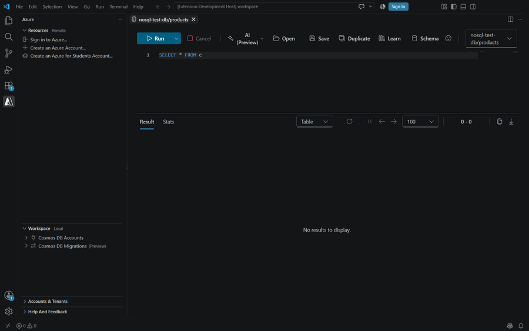
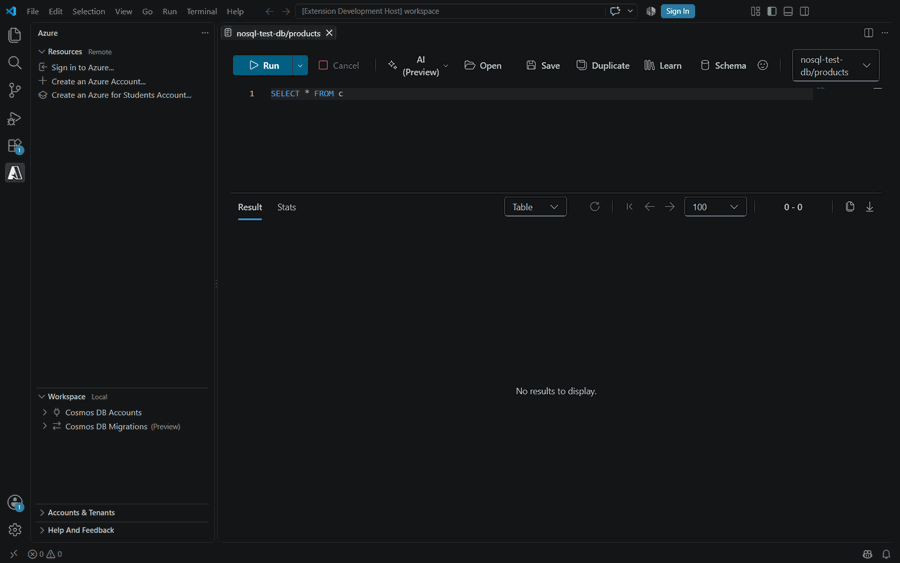
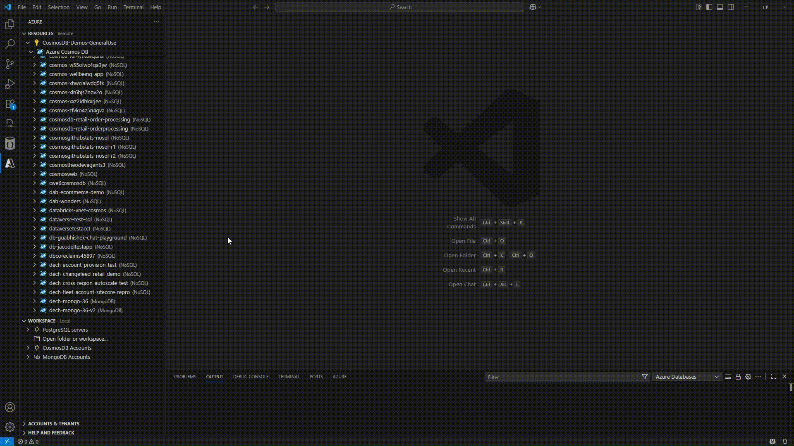

# Azure Cosmos DB for VS Code

<!-- region exclude-from-marketplace -->

<!-- endregion exclude-from-marketplace -->

Connect to **Azure Cosmos DB for NoSQL** from VS Code to explore accounts, manage databases and containers, edit items, and run queries without leaving your editor. Work with Azure accounts, connection strings, or the local Azure Cosmos DB Emulator.

[Install from the Visual Studio Marketplace](https://marketplace.visualstudio.com/items?itemName=ms-azuretools.vscode-cosmosdb) | [Read the documentation](https://learn.microsoft.com/azure/cosmos-db/) | [Report an issue](https://github.com/microsoft/vscode-cosmosdb/issues/new/choose)

## Get Started

<!-- prettier-ignore -->
1. Install the extension from the [Visual Studio Marketplace](https://marketplace.visualstudio.com/items?itemName=ms-azuretools.vscode-cosmosdb) or search for **Azure Cosmos DB** in the VS Code Extensions view.
2. Open the **Azure** view in the Activity Bar and choose how to connect:
   - Sign in to Azure to browse Cosmos DB accounts across your subscriptions.
   - Select **New Connection…** to attach an account with a connection string.
   - Select **New Emulator Connection** under **Local Emulators** to use a local development instance.

3. Expand an account, database, and container. Use the context menu to create or open items, import documents, or launch the Query Editor.
4. Run a query such as `SELECT * FROM c`, then inspect the results as a table, JSON, or tree. Query metrics and index recommendations help you tune the request.

> Don't have an account? [Create an Azure account](https://azure.microsoft.com/free/) or use the [Azure Cosmos DB Emulator](https://learn.microsoft.com/azure/cosmos-db/emulator) for local development.

## Features

| Capability                 | What you can do                                                                                         |
| -------------------------- | ------------------------------------------------------------------------------------------------------- |
| Explore resources          | Browse subscriptions, accounts, databases, containers, items, and server-side scripts.                  |
| Manage data                | Create, edit, delete, and import JSON documents with validation and syntax highlighting.                |
| Build and optimize queries | Use completions and diagnostics, compare result views, inspect request charge, and review index advice. |
| Monitor account health     | Review throughput, RU consumption, partitions, alerts, and recommendations from the account dashboard.  |
| Work locally               | Attach the Azure Cosmos DB Emulator or a connection string without depending on subscription discovery. |
| Use GitHub Copilot         | Generate, edit, and explain Azure Cosmos DB for NoSQL queries from natural-language requests.           |

## Azure Cosmos DB Explorer

The Azure Cosmos DB Explorer helps you find, view, and manage your Azure Cosmos DB databases.

- **Discover Database Accounts**: Scan your Azure subscriptions for available database accounts and browse their resources.

- **Open in Azure Portal**: Open an account directly in the Azure portal for service-level configuration.

- **Manage Resources**: View, create, and delete databases, containers, stored procedures, triggers, and documents.

- **Edit Documents and Scripts**: Open documents and stored procedures in the editor, then save changes to the service.

- **Filter and Sort**: Narrow large resource trees and choose the order that best fits your workflow.

- **Workspace Connections**: Attach database accounts with connection strings, including accounts that are not discoverable through your current Azure subscriptions.

## Account Overview Dashboard

The Account Overview Dashboard gives you an at-a-glance, read-only view of a Cosmos DB account: inventory, provisioned vs. normalized RU consumption, partition health, active alerts, and recommendations. Open it from an account node in the Explorer.

Every section reads from Azure Resource Manager and Azure Monitor. When a section can't load, it shows an explicit empty state instead of a blank panel:

- **No data** — the account is healthy but has no data for the selected window.
- **Not supported** — the section doesn't apply to this account's API (for example, inventory metrics are only available for NoSQL (Core) API accounts).
- **Access required** — your Azure role doesn't grant permission to read the underlying data.

### Required Azure roles

Data is fetched with your Azure credentials, so each section requires the corresponding role assignment. If a role is missing, that section shows an "Access required" empty state naming the role below; the rest of the dashboard continues to work.

| Dashboard section                                      | Minimum Azure role              |
| ------------------------------------------------------ | ------------------------------- |
| Account header, inventory, throughput                  | Reader on the Cosmos DB account |
| RU trends, partition health, Tier-1 derived advisories | Monitoring Reader               |
| Tier-2 (log-based) derived advisories                  | Log Analytics Reader            |
| Active alerts                                          | Monitoring Reader               |
| Advisor recommendations                                | Reader on the subscription      |

Tier-2 derived advisories (cross-partition query fan-out, shard-key misalignment, uncontrolled ingestion, and shared-throughput starvation) additionally read the account's `CDB*` diagnostic-log tables, so they require **Diagnostic Settings → Log Analytics** enabled on the account plus the [Log Analytics Reader](https://learn.microsoft.com/azure/role-based-access-control/built-in-roles/monitor#log-analytics-reader) role (Monitoring Reader also works). When these are missing, the Derived Advisories card still renders every Tier-1 advisory and flags the Tier-2 gap with a "Partial coverage" notice.

Learn more about assigning roles in [Azure role-based access control](https://learn.microsoft.com/azure/role-based-access-control/overview).

For the metrics, detections, and ARM endpoints behind the dashboard, see [`docs/account-overview-dashboard.md`](./docs/account-overview-dashboard.md).

## Query Editor

The Query Editor provides a focused workspace for writing, running, and tuning Azure Cosmos DB for NoSQL queries.

- **Language Support**: Get syntax highlighting, completions, diagnostics, hover documentation, signature help, and formatting. Schema-aware suggestions include properties discovered in the active container.

- **Query History**: Automatically saves previously executed queries, allowing you to open and reuse them later.

- **Run Queries**: Execute queries and view results in Table, JSON, or Tree view.

- **Export Results**: Provides options to copy query results as JSON or CSV or to save them to a file for later use.

- **Pagination**: Adjust how many results are displayed at a time when working with large datasets.

- **Query Insights and Index Advisor**: Review execution time, request charge, response size, activity ID, and indexing recommendations.

- **Edit Documents**: Open, update, and save individual documents.

- **Create New Documents**: Write and validate documents with syntax highlighting.

### Keyboard Shortcuts

The Azure Cosmos DB extension supports various keyboard shortcuts to improve your productivity when working with queries and documents.

For a complete list of keyboard shortcuts, see [Keyboard Shortcuts](docs/hotkeys/01_keyboard_shortcuts.md).

## AI-Powered Query Assistance (GitHub Copilot)

The extension integrates with GitHub Copilot to help you write, edit, and understand Cosmos DB NoSQL queries using natural language.

- **Generate Query**: Click the **AI** button in the Query Editor toolbar and select **Generate query** to describe your query in plain English. Copilot will generate a Cosmos DB NoSQL query for you.

- **Explain Query**: Click the **AI** button and select **Explain query** to get a plain-English explanation of the current query in the editor.

> **Requires** the [GitHub Copilot](https://marketplace.visualstudio.com/items?itemName=GitHub.copilot) extension and an active Copilot subscription.

For more details, see the [AI Chat documentation](src/chat/README.md).

## Import into Azure Cosmos DB

The extension allows you to import documents into Azure Cosmos DB.

- **Workspace Integration**: Use the context menu of a container or JSON document file to start an import.

  

## Attach to the Azure Cosmos DB Emulator

Attach the Azure Cosmos DB Emulator to work with a local instance of Azure Cosmos DB for development and testing purposes.

- **Emulator Installation**: Install and run the [Azure Cosmos DB Emulator](https://learn.microsoft.com/azure/cosmos-db/emulator) on your local machine.

- **New Emulator Connection**: Expand **Cosmos DB Accounts**, then **Local Emulators**, and select **New Emulator Connection** to attach the emulator to your workspace.

For local setup instructions and connection details, see [Azure Cosmos DB Emulator](docs/cosmosdb-emulator.md).

## Known Issues

> [!WARNING]
> Support for previously included features such as MongoDB, PostgreSQL, Graph (Gremlin), Table, Cassandra, and the Grammar Language Server has been removed from this extension.
>
> - For MongoDB support, use the [DocumentDB Extension for VS Code](https://marketplace.visualstudio.com/items?itemName=ms-azuretools.vscode-documentdb).
> - For PostgreSQL support, use the [PostgreSQL Extension for VS Code](https://marketplace.visualstudio.com/items?itemName=ms-ossdata.vscode-pgsql).

<!-- region exclude-from-marketplace -->

## How to Contribute

This project welcomes contributions and suggestions. To contribute, see these documents:

- [Code of Conduct](./CODE_OF_CONDUCT.md)
- [Security](./SECURITY.md)
- [Contributing](./CONTRIBUTING.md)

<!-- endregion exclude-from-marketplace -->

## Telemetry

VS Code collects usage data and sends it to Microsoft to help improve our products and services. Read our [privacy statement](https://go.microsoft.com/fwlink/?LinkID=521839) to learn more. If you don’t wish to send usage data to Microsoft, you can set the `telemetry.enableTelemetry` setting to `false`. If you want to disable feedback requests in VS Code, set `telemetry.feedback.enabled` to `false`. Learn more in our [FAQ](https://code.visualstudio.com/docs/supporting/faq#_how-to-disable-telemetry-reporting).

**Data Collection.** The software may collect information about you and your use of the software and send it to Microsoft. Microsoft may use this information to provide services and improve our products and services. You may turn off the telemetry as described in the repository. There are also some features in the software that may enable you and Microsoft to collect data from users of your applications. If you use these features, you must comply with applicable law, including providing appropriate notices to users of your applications together with a copy of Microsoft’s privacy statement. Our privacy statement is located at https://go.microsoft.com/fwlink/?LinkID=521839. You can learn more about data collection and use in the help documentation and our privacy statement. Your use of the software operates as your consent to these practices.

## License

[MIT](LICENSE.md)
