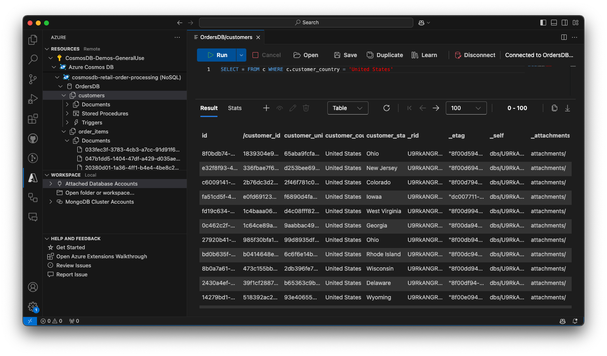

# Azure Databases for VS Code (Preview)

<!-- region exclude-from-marketplace -->

  

<!-- endregion exclude-from-marketplace -->

Browse, manage, and query your Azure databases both locally and in the cloud with support for MongoDB, Graph (Gremlin), and NoSQL (previously known as DocumentDB).

> Sign up today for your free Azure account and receive 12 months of free popular services, $200 free credit and 25+ always free services 👉 [Start Free](https://azure.microsoft.com/free/open-source).

# Prerequisites

- **Mongo Shell Requirement (Optional)**: Some advanced commands in the Mongo [scrapbook](#mongo-scrapbooks) and use of the Mongo shell require installing [Mongo DB and Mongo shell](https://docs.mongodb.com/manual/installation/).

# Features

## Azure Databases Explorer

The Azure Databases Explorer provides a comprehensive interface to explore and manage your Azure databases.

- **Discover Database Servers**: Find database servers in your Azure subscription.
- **Create Database Servers**: Use the `+` button to create a new database server.
- **Azure Portal Integration**: Open database servers directly in the Azure portal.
- **Full Database Management**: View, create, and delete databases, collections, graphs, stored procedures, documents, and queries.
- **Integrated Document Editor**: Open documents, stored procedures, or queries directly in the editor for easy viewing and editing.
- **Edit and Persist Changes**: Make changes to documents and persist them to the cloud.
- **Workspace Integration**: Attach database servers to your workspace using connection strings, enabling centralized management.
- **Flexible MongoDB Connectivity**: Easily establish connections to MongoDB clusters across both Azure and non-Azure environments using a simple connection string.

## Query Editor

The Query Editor provides a powerful interface to write and execute queries across your databases.

- **Rich Syntax Highlighting**: Write queries with built-in syntax highlighting to improve readability and reduce errors.
- **Query History and Management**: Save and open queries from disk, and access query history for re-use.
- **Execute Queries**: Run queries and view the results in multiple formats including Table, JSON, or a hierarchical Tree view (currently NoSQL only).
- **Flexible Result Management**: Copy query results as JSON or CSV to the clipboard or store them in a file as needed.
- **Paging Support**: Choose how many results to display at once with convenient paging support, allowing navigation through large datasets.
- **Query Statistics and Index Advisor**: View detailed query statistics such as consumed RUs, execution time, and index optimization suggestions.
- **Document Management**: View, edit, and update single documents from the result view directly.
- **New Document Creation**: Create new documents with syntax highlighting and partition key validation.

## MongoDB Cluster Support

The extension now offers enhanced support for MongoDB clusters, making it easier than ever to connect, view, and manage your MongoDB resources, whether on Azure or any external cluster.

- **Seamless Connectivity with Azure Cosmos DB for MongoDB vCore**: Effortlessly connect to Azure Cosmos DB for MongoDB vCore.
- **Universal MongoDB Connectivity**: Easily connect to any MongoDB cluster using a connection string, giving you flexibility in managing databases across multiple environments.
- **Comprehensive Collection Viewer**: Navigate collections with rich visualization options, including **Table**, **Tree**, and **JSON views**, to quickly understand and explore your data.
- **Enhanced Query Experience**: Execute find queries with **syntax highlighting** and **intelligent auto-completion**, including field name suggestions, to boost productivity and reduce errors.
- **Paging Support for Large Datasets**: Efficiently browse through large collections with built-in paging support, enabling you to handle data exploration without overwhelming the interface.
- **Document Management**: View, edit, and delete individual documents directly from the interface. Gain the flexibility to manage documents in-place, streamlining the database management process.
- **JSON Import and Export**: Import data from JSON files or export documents as needed. You can even export entire collections or the result of a query, making data sharing simpler and more efficient.

## Scrapbooks

Scrapbooks allow you to run Mongo commands with a rich IntelliSense experience, making it easier to work with your MongoDB databases.

- **Quick Account Viewing**: View your MongoDB database account by clicking "Sign in to Azure..." or use "Attach Database Account" to connect via a connection string.
- **Configurable Shell Settings**: Configure `mongo.shell.path` and `mongo.shell.args` if your mongo executable is not on your system's PATH.
- **Create New Scrapbooks**: Click "New Mongo Scrapbook" in the tree title bar to create a new scrapbook.
- **Database Connection**: Click "Connect to a database" to indicate which database to run commands against.
- **IntelliSense Integration**: Enter commands like `db.<collectionName>.find()` and enjoy full IntelliSense support with auto-completions.
- **Execute Commands Easily**: Click "Execute" or press <kbd>CMD</kbd>+<kbd>"</kbd> (Mac) or <kbd>CTRL</kbd>+<kbd>"</kbd> (Windows/Linux) to execute a command.
- **Batch Execution Support**: Click "Execute All" or press <kbd>CMD</kbd>+<kbd>:</kbd> or <kbd>Ctrl</kbd>+<kbd>:</kbd> to run all commands at once.

  

## Import into Cosmos DB

The extension allows you to import documents into CosmosDB.

- **Workspace Integration**: Use the context menu of a collection or document file (JSON) to initiate import.

  

## Create an Azure Databases Server

Creating an Azure Databases Server is simple and straightforward, allowing you to get started quickly.

1. **Sign In to Azure**: Sign in to your Azure Account by clicking "Sign in to Azure..." in the Azure Resources explorer.
   - If you don't have an Azure Account, select "Create a Free Azure Account" to get started.
2. **Open the Create Resource Menu**: Select the `+` button to open the "Create Resource" menu.

   

3. **Select Create Database Server**: Choose "Create Database Server..." and follow the guided prompts to set up your server.

   

## Attach to the Cosmos DB Emulator

Attach the Cosmos DB Emulator to work with a local instance of Cosmos DB for development and testing purposes.

- **Emulator Installation**: Install and run the [Cosmos DB Emulator](https://docs.microsoft.com/azure/cosmos-db/local-emulator) on your local machine.
- **Attach Emulator**: Right-click 'Attached Database Accounts' and select 'Attach Emulator' to link the emulator to your workspace.

## Known Issues

Here are some known issues and limitations to be aware of when using the Azure Databases extension:

- **Gremlin Endpoint Limitation**: Azure no longer supports Gremlin queries on pre-GA graph accounts. If you encounter an error like "Could not find a valid gremlin endpoint for _graph_", open the graph node in the portal and verify the "Gremlin Endpoint" format. If it does not match the expected form '...[graph-name].**_gremlin_**.cosmosdb.azure.com...', you may need to create a new graph account.
- **Graphs Not Supported with Emulator**: Graphs are not currently supported with the Cosmos DB Emulator.
- **Table Viewing/Editing**: Viewing and editing tables is not currently supported by the extension.
- **Escaped Characters in Scrapbooks**: Scrapbook support for escaped characters is preliminary. Use double escaping for newlines (`\\n` instead of `\n`). If you find issues, report them to [#937](https://github.com/Microsoft/vscode-cosmosdb/issues/937).

<!-- region exclude-from-marketplace -->

# Contributing

There are several ways you can contribute to the [vscode-cosmosdb repository](https://github.com/Microsoft/vscode-cosmosdb):

- **Ideas, feature requests and bugs**: We are open to all ideas, and we want to get rid of bugs! Use the [Issues](https://github.com/Microsoft/vscode-cosmosdb/issues) section to report a new issue, provide your ideas or contribute to existing threads.
- **Documentation**: Found a typo or strangely worded sentences? Submit a PR!
- **Code**: Contribute bug fixes, features or design changes:
  - Clone the repository and open it in VS Code.
  - Run `Extensions: Show Recommended Extensions` from the [command palette](https://code.visualstudio.com/docs/getstarted/userinterface#_command-palette) and install all extensions listed under "Workspace Recommendations"
  - Open the terminal (press <kbd>CTRL</kbd>+<kbd>\`</kbd>) and run `npm install`.
  - Build: press <kbd>Ctrl</kbd>+<kbd>Shift</kbd>+<kbd>B</kbd>, or press <kbd>F1</kbd> and type `Tasks: Run Build Task`.
  - Debug: Select the `Launch Extension (webpack)` configuration in the Debug side bar and press <kbd>F5</kbd> to start debugging the extension.

## Legal

Before we can accept your pull request you will need to sign a **Contribution License Agreement**. All you need to do is to submit a pull request, then the PR will get appropriately labelled (e.g. `cla-required`, `cla-norequired`, `cla-signed`, `cla-already-signed`). If you already signed the agreement we will continue with reviewing the PR, otherwise system will tell you how you can sign the CLA. Once you sign the CLA all future PR's will be labeled as `cla-signed`.

## Code of Conduct

This project has adopted the [Microsoft Open Source Code of Conduct](https://opensource.microsoft.com/codeofconduct/). For more information see the [Code of Conduct FAQ](https://opensource.microsoft.com/codeofconduct/faq/) or contact [opencode@microsoft.com](mailto:opencode@microsoft.com) with any additional questions or comments.

<!-- endregion exclude-from-marketplace -->

# Telemetry

VS Code collects usage data and sends it to Microsoft to help improve our products and services. Read our [privacy statement](https://go.microsoft.com/fwlink/?LinkID=528096&clcid=0x409) to learn more. If you don’t wish to send usage data to Microsoft, you can set the `telemetry.enableTelemetry` setting to `false`. Learn more in our [FAQ](https://code.visualstudio.com/docs/supporting/faq#_how-to-disable-telemetry-reporting).

# License

[MIT](LICENSE.md)
