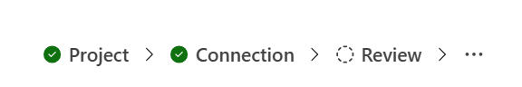

# `StepList`

A step list shows the steps of a multi-step flow and marks the one the user is on. Each step reads
as completed, current, or still ahead, and steps the user may return to are activatable.

When the row runs out of width, steps collapse into an overflow menu. The current step is the last
one to collapse, so it stays visible at any width.

A step list describes a sequence with a position in it. For content views the user may move between
freely, use Fluent's `TabList` instead.



## Best practices

### Do

- Mark completed steps `completed`, including any that open already satisfied.
- Mark a step `navigable` only when returning to it is safe.
- Give `StepList` a parent with `min-width: 0`. `ContainerNav` already does; elsewhere the overflow
  behaviour will not engage without it.
- Let `Wizard` derive `completed` and `navigable` for you when it fits, and override per step when
  it does not.

### Don't

- Render anything but `StepListItem` inside it. Other children are dropped silently, so a
  `{condition && …}` guard is safe.
- Expect `vertical` to do anything yet. The prop is accepted and reserved; the vertical rendering
  arrives in a later release.

## Anatomy

```tsx
<StepList selectedValue={step} onStepSelect={(_e, d) => goToStep(d.value)} ariaLabel="Setup steps">
    <StepListItem value="introduction" completed>
        Introduction
    </StepListItem>
    <StepListItem value="configure" completed navigable>
        Configure
    </StepListItem>
    <StepListItem value="setup">Set up</StepListItem>
    <StepListItem value="done">Done</StepListItem>
</StepList>
```

`StepListItem` renders nothing on its own. `StepList` reads its props, because the dividers between
steps and the overflow menu both need the whole sequence rather than one item at a time. Children
are identified by a `Symbol.for` brand, not by `child.type ===`, which would break silently under
duplicate module instances or a fast refresh.

## Controlled only

A step list is always controlled. `onStepSelect` reports that a step was activated; nothing moves
until you change `selectedValue`.

There is no uncontrolled mode, because the thing that decides which step is current is almost never
the step list. It is the state of the work the flow is doing, and an internal "selected" value
would only ever be a second copy of it.

## Accessibility

- The list is a `navigation` landmark named by `ariaLabel`.
- The current step carries `aria-current="step"`.
- A non-navigable step is `disabledFocusable`: still reachable by keyboard, so a screen-reader user
  can read the whole sequence, but it does nothing when activated.
- Completed steps stay semibold, so a step does not change width when it stops being current and
  shift the whole row. Fluent's own `reserveSelectedTabSpace` exists for the same reason.
- The overflow button is named through `overflowAriaLabel(count)`, which defaults to English.

## Props

See [`StepList.types.ts`](./StepList.types.ts).
