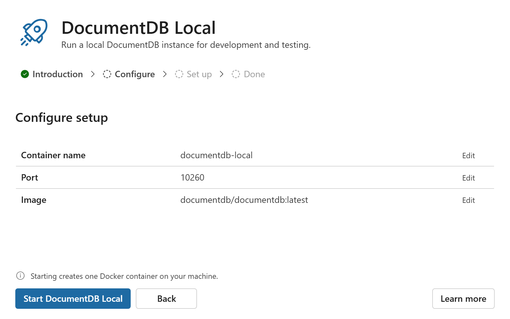

# `Wizard`

A wizard presents a task as a sequence of steps and shows one of them at a time, with a header, a
step indicator and an action bar around it. Steps are declared as `WizardStep` children.

A wizard is controlled. You pass `activeStep`, and it renders the step with that value. Activating
another step in the indicator raises `onStepChange` and changes nothing until you say so.

A wizard is a `Container` and a `StepList` assembled for you, and it uses nothing from them that
you cannot use directly. Compose those yourself when you need a layout a wizard does not offer.



## Best practices

### Do

- Pass `stepsLocked` while work is in flight, or once the outcome is committed.
- Give a step a `title` when its heading should differ from its label in the indicator. It defaults
  to the label.
- Show one step for one place in the task, even when your application distinguishes several
  situations there. See below.
- Keep expensive work out of an inactive step's children. They are not rendered, but you still
  construct them.

### Don't

- Wrap steps in a fragment. A fragment has no props to read, so its steps are ignored.
- Expect an inactive step to keep state. Only the active step is mounted.
- Inject content between the header and the step indicator. There is no slot for it.

## Anatomy

```tsx
<Wizard
    activeStep={currentStep}
    onStepChange={goToStep}
    stepsLocked={isRunning}
    stepsAriaLabel={l10n.t('Setup steps')}
    header={<ContainerHeader media={<RocketRegular />} title="DocumentDB Local" subtitle="…" />}
    footer={
        <ContainerFooter note={footerNote} contentEnd={<Button>{l10n.t('Learn more')}</Button>}>
            <Button appearance="primary" onClick={onPrimary}>
                {primaryLabel}
            </Button>
            {secondaryActions}
        </ContainerFooter>
    }
>
    <WizardStep value="introduction" label={l10n.t('Introduction')} title="…" subtitle="…">
        …
    </WizardStep>
    <WizardStep value="setup" label={l10n.t('Set up')}>
        {isRunning ? progressBody : failureBody}
    </WizardStep>
</Wizard>
```

There is no `WizardHeader` or `WizardFooter`. The slots take `ContainerHeader` and
`ContainerFooter`, which is fewer names and makes the facade relationship visible in the consumer's
own code.

## Children must be `WizardStep`

`Wizard` reads its children's props. `false` and `null` are dropped, so `{isEdit && <WizardStep …>}`
is safe. But **a fragment of steps is ignored**, because a fragment has no props to read. Anything
that is not a branded `WizardStep` is skipped rather than rendered.

That is the cost of declaring a label beside its content, and it is the one thing about this
component that will surprise someone.

## Choosing `activeStep`

`activeStep` is a string you compute. A wizard never sees how you arrived at it, which is what lets
your own state be a different shape from your step list.

Two consequences are worth knowing, because both look like missing features until you try them.

**Several situations can share one step.** An operation that is running and the same operation
after it failed are the same place in the task, so they are one step. Pass the same `activeStep`
for both and let the step's own content tell them apart:

```tsx
<WizardStep
    value="setup"
    label="Set up"
    title={isRunning ? 'Setting up' : 'Setup did not finish'}
>
    {isRunning ? <Progress /> : <Failure onRetry={retry} />}
</WizardStep>
```

The indicator stays put, and a failure is reported where it happened instead of moving the user.

**A step that does not apply is simply not rendered.** `false` and `null` children are dropped, so
the indicator shows three steps instead of four and the derived state follows:

```tsx
{!isEditing && (
    <WizardStep value="choose" label="Choose method">
        …
    </WizardStep>
)}
```

## What a wizard does not do

It owns no navigation logic, no button labels, no disabled rules, and no focus handling across a
button that swaps mid-step. Those differ between flows enough that any shared version would be a
list of predicates you supply anyway.

## Derived state, and when to override it

```ts
completed = index === 0 || index < activeIndex || (index === last && index === activeIndex);
navigable = index < activeIndex && !stepsLocked;
```

Override either per step when a flow disagrees: a mode whose first step is not already satisfied,
or one that allows returning to only some earlier steps.

## Accessibility

Everything `Container` and `StepList` guarantee, plus one thing that belongs to the facade: the
active step's section is keyed by `activeStep`, so every step change mounts a fresh section and
moves focus to its heading (WCAG 2.4.3). The first render is exempt.

## Props

See [`Wizard.types.ts`](./Wizard.types.ts).
